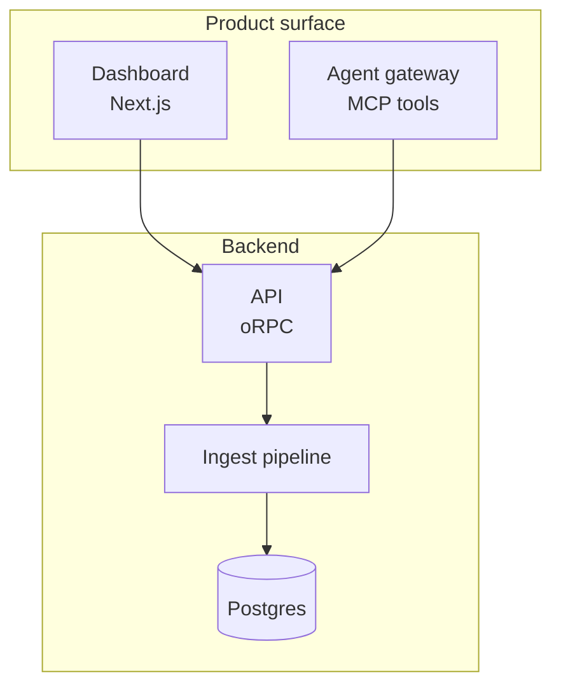

# sideshow — design guide for agents

You are drawing to a persistent visual surface the user keeps open in a browser.
Your posts appear instantly as cards, grouped into a session for this
conversation. Read this once before your first publish.

## Posts and surfaces

A **post** is a card built from an ordered list of **surfaces**. Each surface has
a `kind`:

- **`html`** — arbitrary markup you write, rendered in a sandboxed iframe (the
  rest of this guide is the contract for it). Reach for it for diagrams, UI
  sketches, data viz — anything you draw.
- **`markdown`** — prose you hand over as _text_; the viewer renders it with
  consistent typography (headings, lists, tables, links, and syntax-highlighted
  fenced code blocks — tag the fence with a language, e.g. ` ```ts `). Reach for
  it for explanations, plans, and tradeoff write-ups — anything you'd otherwise
  hand-format in html. Markdown image syntax works too: ``
  embeds an uploaded image (see Uploads below) inline, so one markdown surface can
  interleave prose, tables, code, and pictures. Only raw _HTML_ in the source is
  escaped, not rendered — reach for an `html` surface when you need live markup
  (interactivity, vector graphics, custom layout), not just to show a picture.
- **`mermaid`** — diagram source you hand over as _text_; the viewer renders it
  to an SVG (flowcharts, sequence diagrams, ERDs, gantt, state, …). Reach for it
  when the _shape_ of a system is the point and you'd rather describe it than
  draw SVG by hand. The source travels as data and renders in a sandboxed Mermaid
  frame (securityLevel `strict`); for bespoke vector art hand-write inline `<svg>`
  in an `html` surface instead. Prefer vertical flowcharts (`flowchart TD`/`TB`)
  for sideshow cards;
  wide `LR` system maps shrink to fit the card and become unreadable. The viewer
  themes the diagram (light and dark) automatically — **don't set your own
  colors**. Highlight flowchart nodes with `:::accent` (or `class A,B accent`)
  and edges with `accentLine` (pair with `linkStyle`); sequence diagrams style
  actors globally only.
- **`diff`** — a patch you hand over as _data_; the trusted viewer renders it
  natively as a syntax-highlighted code review (split or unified). Reach for it
  to show a changeset or review code, not to draw.
- **`image`** — an uploaded image, referenced by `assetId` (see Uploads below),
  rendered natively by the viewer. Reach for it to show a screenshot or a
  generated picture.
- **`trace`** — an agent trace rendered as a step timeline beside the post.
  Steps can travel inline, or live in an uploaded file you reference and offer
  for download.
- **`terminal`** — monospace terminal output, rendered natively as a terminal
  window. The `text` travels inline and may carry ANSI SGR escapes (colors,
  bold, italic, underline); the viewer renders those and HTML-escapes the rest.
  Reach for it to share shell output, build logs, or example commands. (Colors
  yes; cursor-addressing TUIs are not resolved — share a captured frame.)
- **`json`** — a pre-parsed JSON value (`data`), rendered natively by the viewer
  as a collapsible tree. Objects and arrays expand/collapse on click; primitives
  show inline with type-colored values (strings, numbers, booleans, null). Reach
  for it for API responses, config files, test results — any structured data
  where a tree beats a fenced code block. Like image/trace it is data, not
  markup: the viewer renders it with escaped text nodes, so no sandbox is needed.
- **`code`** — source code you hand over as _text_; the trusted viewer highlights
  it with shiki (same highlighter as markdown fenced code blocks) and renders it
  in a sandboxed iframe. `language` is a shiki lang id (`ts`, `js`, `python`,
  `rust`, `go`, …); omit or use `text` for plain monospace. `title` is an
  optional label (e.g. a filename) shown above the code. `lineStart` is an
  optional 1-based line number the excerpt starts at — the viewer shows original
  line numbers instead of 1-based, so you can say "lines 80-150 of x.ts".
  Reach for it when a whole file or snippet is the point — cleaner than a
  markdown surface with one fenced block, and the kind shows up as `code` in the
  card metadata.

For an issue/PR/CI tree, status board, or stepped deck, reach for an `html`
surface with a kit (see Kits below) rather than a dedicated surface kind.

A post can combine surfaces, e.g. `[html, diff]` is a diagram with its code
review in one card, and `[markdown, diff]` is a written rationale above its
changeset. Trust differs: html surfaces are sandboxed because you author the
markup; markdown/mermaid/diff/image/trace/terminal surfaces are rendered
by the viewer from data — send data, never markup.

A **`Surface`** is one of:

```
{ "kind": "html", "html": "<p>...</p>" }
{ "kind": "markdown", "markdown": "## Plan\n\n1. ...\n2. ..." }
{ "kind": "mermaid", "mermaid": "graph TD; A[Start] --> B{Ok?}; B -->|yes| C; B -->|no| D" }
{ "kind": "diff", "patch": "<unified or git diff text>" }                          # preferred — compact
{ "kind": "diff", "files": [{ "filename": "a.ts", "before": "...", "after": "...", "language": "ts" }] }  # fallback
{ "kind": "image", "assetId": "<id from an upload>", "alt": "...", "caption": "..." }
{ "kind": "trace", "steps": [{ "label": "...", "kind": "tool", "detail": "...", "ts": "..." }] }
{ "kind": "trace", "assetId": "<id of an uploaded JSON/JSONL trace>", "title": "..." }
{ "kind": "terminal", "text": "<output, may include ANSI SGR escapes>", "cols": 80, "title": "..." }
{ "kind": "json", "data": { "a": 1, "b": [true, null, "hi"] } }
{ "kind": "code", "code": "const x = 42;", "language": "ts", "title": "example.ts" }
{ "kind": "code", "code": "...", "language": "ts", "title": "x.ts", "lineStart": 80 }
{ "kind": "html", "html": "<ul class=\"tree\">...</ul>", "kits": ["issues"] }   # opt into a kit (see Kits)
```

For a diff, send a `patch` — it carries only the changed lines, so it is the
compact, preferred form. Use `files` (full before/after contents) only when you
don't have a patch. A diff surface takes an optional `"layout": "unified" | "split"`.

### Mermaid layout tips

Mermaid diagrams render inside the same card column as everything else, so huge
left-to-right canvases are scaled down until the text is tiny. Optimize for the
card first:

- Default to `flowchart TD` or `flowchart TB`. Use `LR` only for short, truly
  linear flows with a handful of columns.
- Split whole-system architecture maps into multiple diagrams/posts: context,
  data flow, deploy/runtime, and ownership are usually easier to read separately.
- Keep node labels short; put explanation in a markdown surface above or below
  the diagram. Use `<br/>` in labels when a name needs wrapping.
- Use `subgraph` blocks to group layers vertically rather than stretching one
  row across the screen.
- If a diagram still needs to be wide, it is okay: the viewer offers a fullscreen
  control on Mermaid surfaces, but the inline card should remain legible enough
  to preview.

Prefer this shape:



Avoid one-screen maps that put every package/service in a single `flowchart LR`
row; they will fit the width by shrinking the text.

## Uploads (images, traces, files)

Push a binary asset once, reference it by id. Three ways, same result:

```
POST /api/assets   (raw)   Content-Type: image/png   <bytes>     ?filename=shot.png&kind=image&session=<id>
POST /api/assets   (json)  { "data": "<base64>", "contentType": "image/png", "filename": "shot.png", "session": "<id>" }
MCP  upload_asset  { data: "<base64>", contentType, filename?, kind?, session? }
CLI  sideshow upload shot.png         # prints { id, url }
```

The response carries `{ id, url }`. Then reference the asset three ways: as an
`image` surface (`{ "kind": "image", "assetId": "<id>" }`) when the picture is the
post; inline in a `markdown` surface (``) to sit it beside
prose; or inside an html surface (`">`) when you're drawing. Per-asset
limit is 5 MB.

An asset's **id is the SHA-256 of its bytes**, so the URL is content-addressed:
derive it locally (`sideshow asset-url shot.png`, or `shasum -a 256`) and write
the `">` or `assetId` into your post _before_ uploading —
bytes can follow in any order and the viewer briefly waits for an in-flight asset
rather than showing a broken image. Identical bytes dedupe to one blob, and an
asset survives as long as any post references it (even across sessions).

CLI shortcuts: `sideshow image shot.png --title "…"` (upload + publish in one
shot), `sideshow trace run.json --title "…"`, `sideshow publish sketch.html
--image shot.png`, and `sideshow asset-url shot.png` (print the URL without
uploading).

## Publishing

Via MCP tools (preferred): `publish_post`, `update_post`,
`wait_for_feedback`, `reply_to_user`, `list_posts`. (`publish_surface` /
`update_surface` remain as deprecated aliases; `publish_snippet` /
`update_snippet` remain as html-only sugar aliases.) Via CLI:
`sideshow publish file.html --title "..."`, `sideshow diff change.patch
--title "..."`, `sideshow wait`. Via raw HTTP:

```
POST /api/posts          { "title": "...", "surfaces": [...], "session": "<id>", "agent": "your-name" }
PUT  /api/posts/:id        { "surfaces": [...] }   # revise — same card, new version
GET  /api/sessions/:id/posts                       # list a session's posts
GET  /api/comments?session=<id>&author=user&wait=60   # user feedback (long-poll, resumes where you left off)
```

The legacy `POST /api/surfaces` (body key `parts`) and `POST /api/snippets
{ "html": "..." }` endpoints still work as back-compat aliases.

### Examples

A combined `[html, diff]` post — a diagram above its code review. Drop a
surface for the single-surface cases:

```
POST /api/posts  { "title": "Retry flow", "surfaces": [
  { "kind": "html", "html": "<svg ...>" },
  { "kind": "diff", "patch": "--- a/x.ts\n+++ b/x.ts\n@@ ..." }
]}
```

CLI equivalents — one verb per kind, or compose with `--diff`:

```
sideshow publish sketch.html --title "Cache layout"        # html
sideshow markdown plan.md --title "Migration plan"         # markdown
sideshow mermaid flow.mmd --title "Request flow"           # mermaid
sideshow diff change.patch --layout split --title "..."    # diff
sideshow json data.json --title "API response"             # json (collapsible tree)
sideshow code app.ts --title "Entry point"                  # code (lang inferred from filename)
sideshow code - --language python --title "Script"          # code from stdin
sideshow code app.ts --line-start 80 --title "app.ts"       # excerpt with original line numbers
sideshow publish sketch.html --diff change.patch --title "Retry flow"   # [html, diff]
```

Omit `session` on your first publish; the response's `sessionId` is yours —
reuse it to keep posts grouped. On that first publish also set a session
title naming the _task_ ("Auth refactor"), not your tool — `sessionTitle` (MCP
and HTTP) or `--session-title` (CLI); it applies only at creation, so never
retitle later. To refine a post, UPDATE it rather than republishing a
near-duplicate — versions are kept and the user can flip between them.

## The feedback loop

The user can type comments under any post. Comments attach to a post
(`postId`). Feedback reaches you three ways:

- **Piggyback (automatic).** Every publish/update/reply response may include a
  `userFeedback` array — comments the user left since your last call. Treat
  them as messages from the user; they are delivered once. You never need to
  poll while you are actively publishing.
- **Blocking wait.** `wait_for_feedback` (MCP), `sideshow wait` (CLI), or the
  long-poll endpoint — use at a checkpoint when you explicitly want a reaction
  before continuing.
- **Background watch.** If your harness supports background processes, arm
  `sideshow wait --timeout 600` in the background after your first publish and
  keep working; when it exits with comments, handle them and re-arm. Always arm
  it on the session you actually published to.

You can answer in the thread with `reply_to_user` / `sideshow comment` — keep
replies short; do substantial revisions as post updates instead.

## HTML contract

An `html` surface is a blank canvas — invent the visualization the idea deserves.
Custom SVG, bespoke layouts, small interactions, animation, an unusual way to
show a relationship: all fair game, and more useful than a safe diagram. The
contract below is a short list of hard constraints (sandboxing, sizing) plus
helpers — the kit and theme tokens — that exist to remove busywork and
guarantee legibility in both themes, **not** to push every post toward one
look. Reach for them when they fit; hand-roll freely when your idea is better
served another way. The constraints keep it readable; what you draw inside them
is yours.

- Send a **body fragment only** — no `<!doctype>`, `<html>`, `<head>`, or `<body>`.
  The server wraps your fragment in a themed, sandboxed document.
- The rendered column is roughly **720–800px wide**. Content sizes its own
  height automatically.
- `<style>` and `<script>` tags are allowed. Scripts run inside a sandboxed
  iframe with no access to the host page.
- **Keep content in normal flow.** The frame measures your content's height from
  the document box, so anything taken out of flow is invisible to the sizer and
  can leave the surface clipped — or frozen at the wrong height after load.
  - Never use `position: fixed`.
  - Don't stack `position: absolute` layers over a fixed-`height`/`min-height`
    box (the usual cross-fade-deck mistake): the overlay grows `scrollHeight` but
    not the measured box, so the frame won't follow it.
  - To **overlap** elements (e.g. a cross-fading slide deck), grid-stack them in
    normal flow instead — `display: grid` on the container, `grid-area: 1 / 1` on
    each child: they overlap, but the container still sizes to the tallest child.
    (The `slides` kit does exactly this — reach for it before hand-rolling a deck.)

## Built-in kit — a head start, not a straitjacket

These primitives save you from restyling the basics; ignore any that don't suit
the picture you have in mind. Bare `button`, `input`, `select`, and `textarea`
are pre-styled to match the viewer, hover/focus included — write the plain
element, don't restyle it.
Checkboxes, radios, ranges, and progress bars are themed via `accent-color`.

SVG utility classes, available in every html surface:

| class                                                            | effect                                                                                                               |
| ---------------------------------------------------------------- | -------------------------------------------------------------------------------------------------------------------- |
| `t` / `ts` / `th`                                                | text presets: 14px / 12px muted / 14px medium heading                                                                |
| `name` / `sub`                                                   | node name in sans / technical sublabel in mono                                                                       |
| `eyebrow` / `lbl`                                                | uppercase grotesk zone/type tag / connector label                                                                    |
| `box`                                                            | neutral rect — secondary fill, faint 1px stroke, rx 6                                                                |
| `arr`                                                            | 1px connector with rounded caps and joins                                                                            |
| `leader` / `dashed`                                              | dashed guide line / async or optional connector                                                                      |
| `mask` / `zone`                                                  | opaque connector-label backdrop / dashed grouping boundary                                                           |
| `focal`                                                          | info-token fill and stroke for a highlighted node; child text uses info ink                                          |
| `callout`                                                        | italic serif aside; pair with the existing dashed `.leader`                                                          |
| `node`                                                           | pointer cursor + hover dim, for clickable shapes                                                                     |
| `c-blue` `c-teal` `c-amber` `c-coral` `c-green` `c-red` `c-gray` | color ramp: fill+stroke on shapes (or a whole `<g>`); child `<text>` auto-switches to readable ink in light and dark |

An `<svg role="img">` should start with a `<title>` and `<desc>` and use
prefixed ids. The injected `<marker id="arrow">` inherits the line's stroke
color. Mask connector labels 6–8px above the line so the label clears it.

```html
<svg role="img" aria-labelledby="gateway-title gateway-desc" width="100%" viewBox="0 0 440 112">
  <title id="gateway-title">Request gateway</title>
  <desc id="gateway-desc">A client sends a request to the auth API.</desc>
  <rect class="zone" x="264" y="20" width="165" height="74" />
  <text class="eyebrow" x="278" y="36">AUTH</text>
  <line class="arr" x1="130" y1="58" x2="278" y2="58" marker-end="url(#arrow)" />
  <rect class="mask" x="174" y="34" width="72" height="16" />
  <text class="lbl" x="210" y="45" text-anchor="middle">HTTPS</text>
  <rect class="box" x="10" y="36" width="120" height="44" />
  <text class="name" x="70" y="56" text-anchor="middle">Client</text>
  <text class="sub" x="70" y="72" text-anchor="middle">service caller</text>
  <g class="focal">
    <rect class="box" x="278" y="42" width="136" height="42" />
    <text class="name" x="346" y="60" text-anchor="middle">Auth API</text>
    <text class="sub" x="346" y="76" text-anchor="middle">POST /jobs</text>
  </g>
</svg>
```

Icons: the Tabler webfont is on the CSP allowlist —
`<link rel="stylesheet" href="https://cdn.jsdelivr.net/npm/@tabler/icons-webfont@3/dist/tabler-icons.min.css">`
then `<i class="ti ti-check"></i>`.

## Kits — opt-in component bundles

A **kit** is a richer vocabulary an html surface opts into. List kit ids in the
surface's `kits` and the sandbox doc gets that kit's CSS (and, for behavior kits,
JS) on top of the base — so you write compact class-based markup instead of
hand-rolling styles. A plain html surface (no `kits`) is untouched: the vocabulary
ships only when you ask, so default html stays fully freeform. Discover them
with `sideshow kits` (or `GET /api/kits`). Every class resolves against the
theme tokens, so kit output re-themes with the workspace.

- **`issues`** — `.card` · nesting `.tree` rail · `.badge` (`.ok`/`.info`/`.warn`/`.danger`)
  · `.dot` · mono `.chip` · `.bar > i` rollup, plus layout (`.row`/`.stack`/`.between`/`.grow`)
  and text (`.dim`/`.faint`/`.mono`/`.title`) helpers. Composes an issue/PR/CI
  tree — nest a `.tree` inside a `.tree` to indent — or a status board, from
  generic primitives.
- **`slides`** — author a `.deck` with `.slide` children; the kit cross-fades one
  at a time (grid-stacked in normal flow, so the frame always sizes to the tallest
  slide) and injects prev/dots/counter/next controls. Arrow keys and PageUp/Down
  navigate.
- **`charts`** — editorial `<figure class="chart">` frame with eyebrow, headline,
  dek, source caption and a wrapping `.legend`; SVG `.gridline`, `.axis`, `.tick`,
  `.cat`, `.value`, `.col`, `.trend`, `.pt` and `.area` styles use theme-derived
  muted series (`.s1`–`.s4`) and one info-token `.focal` accent. No `.bar` selector,
  so it composes safely with `issues`.

```html
<figure class="chart">
  <span class="eyebrow">Build pipeline</span>
  <h3>Compile time by release</h3>
  <svg width="100%" viewBox="0 0 480 160" role="img" aria-labelledby="build-title build-desc">
    <title id="build-title">Compile minutes by release</title>
    <desc id="build-desc">Five releases, with cache v2 highlighted.</desc>
    <g class="gridline">
      <line x1="48" y1="126" x2="460" y2="126" />
      <line x1="48" y1="88" x2="460" y2="88" />
      <line x1="48" y1="50" x2="460" y2="50" />
    </g>
    <g class="axis">
      <line x1="48" y1="42" x2="48" y2="126" />
      <line x1="48" y1="126" x2="460" y2="126" />
    </g>
    <g class="tick" text-anchor="end">
      <text x="40" y="130">0</text>
      <text x="40" y="92">10</text>
      <text x="40" y="54">20</text>
    </g>
    <rect class="col" x="78" y="64" width="42" height="62" />
    <rect class="col" x="154" y="70" width="42" height="56" />
    <rect class="col focal" x="230" y="82" width="42" height="44" />
    <rect class="col" x="306" y="94" width="42" height="32" />
    <rect class="col" x="382" y="104" width="42" height="22" />
    <g class="cat" text-anchor="middle">
      <text x="99" y="146">Base</text>
      <text x="175" y="146">Cache</text>
      <text x="251" y="146">v2</text>
      <text x="327" y="146">v3</text>
      <text x="403" y="146">Now</text>
    </g>
  </svg>
  <div class="legend">
    <span class="key"><i></i>Other releases</span>
    <span class="key"><i class="focal"></i>Cache v2</span>
  </div>
  <figcaption class="source">Source: CI jobs, median wall-clock minutes.</figcaption>
</figure>
```

```sh
sideshow publish board.html --kit issues       # CLI (repeatable: --kit a --kit b)
```

```js
publish_post({ surfaces: [{ kind: "html", html, kits: ["issues"] }] }); // MCP
```

```json
{ "html": "<ul class=\"tree\">…</ul>", "kits": ["issues"] } // POST /api/snippets
```

A kit only adds vocabulary — you can hand-roll custom markup right beside the
kit classes in the same surface.

## Diagrams & charts

Adapted from cathrynlavery/diagram-design (MIT).

- First ask whether a table or paragraph would answer the question more clearly.
- Delete before adding. Aim for visual density around 4/10, not a map of everything.
- Keep diagrams to ≤9 nodes and ≤12 connectors; beyond that, split overview and detail.
- Use one or two focal elements at most; keep every other shape quiet.
- Use series colours only when lines or areas overlap and need telling apart; for single-series bars keep non-focal marks muted.
- Prefer orthogonal connectors: straight when aligned, right-angle elbows otherwise.
- Draw connectors before boxes. Avoid diagonals, stacked lines and overlapping routes.
- Give parallel connectors ≥12px separation and distinct, intentional attach points.
- Keep labels to about three words; place them on `.mask` with a 6–8px line gap.
- Use a bottom-strip legend only for types that actually appear in the diagram.
- Align geometry to a 4px grid; use names in sans 500 and technical text in mono.
- Use grotesk eyebrows for tags/axes, display serif for titles, and italic serif for asides.
- Limit editorial callouts to two; keep them brief and connect each with a `.leader`.
- Make SVG accessible: `role="img"`, `<title>` first, a useful `<desc>`, and prefixed ids.
- For charts, start bars at zero; use 4–8 bars and no more than five series.
- Highlight one focal series; label values directly where that stays legible.
- Keep category labels horizontal or within 45°; never use 3D, gradients or smoothing
  that implies precision absent from sampled data.
- State the source and unit. Prefer hand-written SVG with the `charts` kit.
- If a CDN chart library is necessary, read palette values from computed CSS
  variables and use the Timeless font tokens; do not introduce a second theme.

## Theming — dark mode is mandatory

This is the one firm rule, because it's about adaptiveness, not taste: drive
every color from the pre-defined CSS variables (a full semantic palette to
compose with) so it adapts to light/dark automatically. Never hardcode colors;
`color: #333` is invisible in dark mode.

- Backgrounds: `--color-background-primary|secondary|tertiary` and semantic
  `-info|-danger|-success|-warning`
- Text: `--color-text-primary|secondary|tertiary`, plus the same semantic variants
- Borders: `--color-border-tertiary` (default, faint), `-secondary`, `-primary`,
  plus semantic variants
- Fonts: use `--font-sans` for UI and body text, `--font-serif` for long reading
  prose, `--font-display` for headlines at least 20px and big numbers,
  `--font-grotesk` for wordmarks, overlines and small-caps labels, and
  `--font-mono` for code. Radius: `--border-radius-md|lg|xl` (8/12/16px).

Mental test: if the background were near-black, would every element still read?

## External resources

A CSP allows loading ONLY from these origins (anything else silently fails):
`cdnjs.cloudflare.com`, `esm.sh`, `cdn.jsdelivr.net`, `unpkg.com`,
`fonts.googleapis.com`, `fonts.gstatic.com`. Images may load from any https URL,
a `data:` URI, or an asset you uploaded to this server (`">`).

## Interactivity

Two globals are injected into every html surface:

- `sendPrompt(text)` — posts `text` to this post's thread as a `surface`
  message (not a user comment): the user sees it, but it does NOT reach you
  through the feedback loop on its own, and it can never impersonate the user.
  Use it for "explore X" affordances the user can then relay to you deliberately.
- `openLink(url)` — asks the user to confirm opening an external link.
  Plain `<a href>` clicks are routed through this automatically.

## Style

A few guardrails that keep posts feeling native to the viewer — they shape
the finish, not the idea. Be as inventive as you like with structure, layout,
and how you show a relationship; just land it in this register:

- Flat and clean: no gradients, drop shadows, or decorative effects.
- Sentence case for headings and labels. No emoji.
- Two font weights only: 400 and 500.
- SVG works great — for diagrams use `<svg width="100%" viewBox="0 0 680 H">`
  with the kit classes above.
- Keep it focused: one concept per post. Publish a series of small posts
  with distinct titles rather than one giant page.
